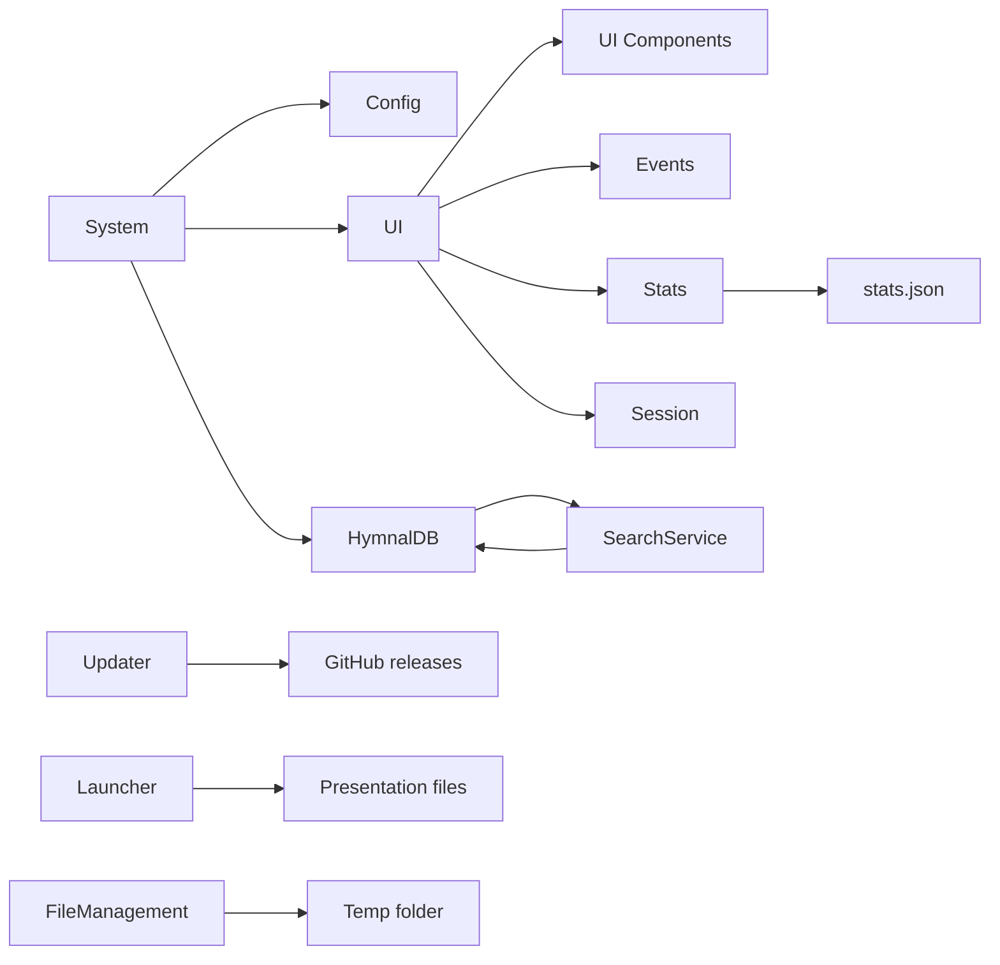
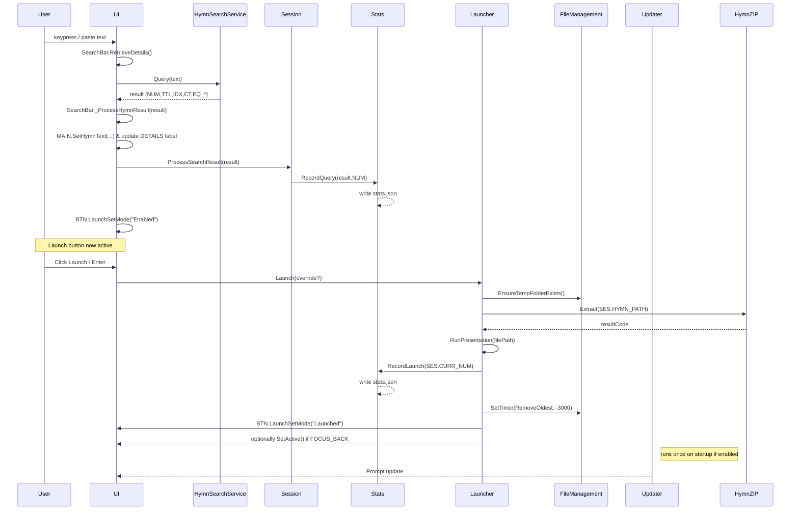

# Hymnal Browser Lite Documentation

_Last updated: March 12, 2026_

---

## Table of Contents

- [Hymnal Browser Lite Documentation](#hymnal-browser-lite-documentation)
  - [Table of Contents](#table-of-contents)
  - [📌 Overview](#-overview)
  - [🚀 Getting Started](#-getting-started)
    - [Requirements](#requirements)
    - [Dependencies](#dependencies)
    - [Installation](#installation)
    - [First Run \& Configuration](#first-run--configuration)
    - [Auto‑Updater](#autoupdater)
    - [Running the App](#running-the-app)
      - [Command‑Line Options](#commandline-options)
  - [✅ Features](#-features)
  - [⚙️ Configuration](#️-configuration)
    - [Available options](#available-options)
  - [🧱 Code Architecture](#-code-architecture)
    - [Directory layout](#directory-layout)
      - [Architecture diagram](#architecture-diagram)
    - [Primary classes](#primary-classes)
  - [🖥️ User Interface](#️-user-interface)
    - [Main window](#main-window)
    - [Completer window](#completer-window)
    - [Settings window](#settings-window)
    - [Tray menu](#tray-menu)
  - [🔄 Program Flow](#-program-flow)
  - [🚨 Error Handling](#-error-handling)
    - [Exit codes](#exit-codes)
    - [Error names](#error-names)
  - [🔔 Events](#-events)
    - [System](#system)
    - [Launch](#launch)
    - [Settings](#settings)
    - [Search](#search)
  - [🛠️ Developer Notes](#️-developer-notes)
  - [📚 Acknowledgements](#-acknowledgements)

---

## 📌 Overview

**Hymnal Browser Lite** is a portable, lightweight hymn lookup and presentation launcher tailored
for the Seventh‑day Adventist Philippine hymnals. It lets users search by number or keyword
and open the corresponding `.pptx` file in a single keystroke.

This document targets both end‑users and developers; it describes how to install and run the
application, explains the code architecture, and provides notes for contributors.

---

## 🚀 Getting Started

### Requirements

- Windows 10 or later
- [AutoHotkey v2](https://www.autohotkey.com/) (if running from source)
- A valid hymnal database (`.sda` file) – the default package is shipped with the release
- Microsoft PowerPoint or any application registered to open `.pptx` files

### Dependencies

The application includes and/or requires the following libraries under the `src/` tree:

- **AHK2ExtLib** – extended AutoHotkey utilities by @verdaderoken
- **KConfig** – configuration serializer/deserializer
- **SevenZip** – wrapper for extracting hymnal archives

These dependencies are bundled with the executable; no separate installation is needed. When running the script from source the libraries must still be discoverable by AutoHotkey. By default `main.ahk` looks in `%A_MyDocuments%/AutoHotkey/Lib` – you can copy or create symbolic links for `src/AHK2ExtLib`, `src/KConfig`, and `src/SevenZip` there, or alter the `#Include` paths in `main.ahk` to point at the corresponding folders under `src/`.

### Installation

1. **Download** the latest ZIP from [releases](https://github.com/msdacsystems/hymnalbrowser-lite/releases).
2. **Extract** anywhere; the program is portable and does **not** require installation.
3. Run `Hymnal Browser Lite.exe` or `main.ahk` (script mode).
   - When running from source, ensure the required libraries are available to AutoHotkey
     (see **Dependencies** above). Copy or symlink `src/AHK2ExtLib`, `src/KConfig`, and
     `src/SevenZip` into `%A_MyDocuments%/AutoHotkey/Lib` or adjust the `#Include` paths
     in `main.ahk` to point at the respective `src/` folders.

> The first run will create a configuration file in `%PROGRAMDATA%\\MSDAC Systems\\Hymnal Browser Lite\\settings.cfg`. 

### First Run & Configuration

On startup the app:

1. Ensures required directories exist (`logs`, `data`, `temp`, etc.).
2. Loads or generates `settings.cfg` with sane defaults. See **Configuration** below for details.
3. Scans the hymnal package and populates internal indexes for quick lookup.
4. Instantiates the UI and attaches event handlers.
5. Optionally checks GitHub for updates (enabled by default).

If you prefer to edit settings manually, look in `%PROGRAMDATA%\\MSDAC Systems\\Hymnal Browser Lite\\settings.cfg`. 
Missing keys are automatically added at launch.

### Auto‑Updater

A built‑in updater (class `Updater`) queries the GitHub releases of `msdacsystems/hymnalbrowser-lite`.
If a newer version is found, the user is prompted to download and install it. Pre‑releases are ignored.

Updates are downloaded to `%TEMP%` and applied via the bundled installer helper. The process
runs even after the main window closes; successful updates exit with code `12` to indicate the
updater launched.

### Running the App

- Type a hymn **number** (e.g. `42`) or part of a **title** in the search box.
- Press <kbd>Enter</kbd> or click **Launch** to open the corresponding presentation.
- Use <kbd>Ctrl</kbd> + <kbd>Backspace</kbd> to clear the search field.

#### Command‑Line Options

The application accepts two optional switches when invoked from a terminal or
via a shortcut:

| Switch | Alias         | Description                                               |
| ------ | ------------- | --------------------------------------------------------- |
| `-s`   | `--slideshow` | Start the presentation in slideshow mode                  |
| `-q`   | `--query`     | Pre‑populate the search field with the following argument |

Examples:

```powershell
& "Hymnal Browser Lite.exe" -s
& "Hymnal Browser Lite.exe" --query "80"
```

The arguments are parsed by `src/system/args.ahk` and merged with configuration
values at startup.

The search bar supports English and Tagalog hymns; results appear in the transparent completer
window as you type.

---

## ✅ Features

- Quick search by number or keyword (English/Tagalog)
- Launch `.pptx` files directly or in slideshow mode
- Portable – no installer required
- Auto‑update mechanism with progress dialog
- Session statistics (queries and launches) saved as JSON
- Developer mode with extra context‑menu options and verbose logging
- Configuration GUI (partial) and editable `settings.cfg`

---

## ⚙️ Configuration

Configuration is handled by `src/config.ahk` and accessible via the global `CF` object.
Defaults are merged with user settings; unknown keys are ignored.

File location:

```text
%PROGRAMDATA%\\MSDAC Systems\\Hymnal Browser Lite\\settings.cfg
```

### Available options

| Section  | Key             | Type | Default | Description                              |
| -------- | --------------- | ---- | ------- | ---------------------------------------- |
| `MAIN`   | `VERBOSE_LOG`   | bool | `false` | Show debug-level log entries             |
| `MAIN`   | `CHECK_UPDATES` | bool | `true`  | Query GitHub for new releases on startup |
| `WINDOW` | `ALWAYS_ON_TOP` | bool | `true`  | Keep main window above others            |
| `WINDOW` | `XPOS`,`YPOS`   | int  | `0`     | Saved window coordinates                 |
| `WINDOW` | `MON`           | int  | `1`     | Preferred monitor number                 |
| `LAUNCH` | `FOCUS_BACK`    | bool | `false` | Return focus after launching file        |
| `LAUNCH` | `TYPE`          | int  | `0`     | 0=Open, 1=Slideshow mode                 |

Hidden/advanced keys (not written to disk):

- `TME_QUERY` – debounce time for search counting (seconds)
- `TEMP.MAX_RECENT` – max temp files kept
- `HYMNAL.PACKAGE` – filename of the hymnal database

Any new keys added by the program are automatically written back to the file.

---

## 🧱 Code Architecture

### Directory layout

```text
src/
  config.ahk           ← user configuration loader/generator
  hymnal.ahk           ← parser for .sda hymn package
  launcher.ahk         ← presentation extraction & launch logic
  session.ahk          ← in‑memory session state
  stats.ahk            ← collects and serializes usage data
  system/
    args.ahk           ← command‑line argument parser
    background.ahk     ← periodic window/activity monitor
    errors.ahk         ← centralized error definitions/handler
    fileManagement.ahk← temp file cleanup helpers
    search.ahk         ← hymn search service (core lookup)
    system.ahk         ← application startup and utilities
    updater.ahk        ← auto‑update checking and download
  interface/
    mainmenu.ahk       ← main window layout controls
    searchbar.ahk      ← search input widget logic
    settings.ahk       ← configuration GUI (partial)
    buttons.ahk        ← generic button wrappers
    completer.ahk      ← suggestion dropdown window
    contextMenu.ahk    ← right‑click menu definitions
    …
```

#### Architecture diagram



### Primary classes

**Core**

| Class            | Responsibility                                                    |
| ---------------- | ----------------------------------------------------------------- |
| `System`         | startup, directory verification, environment loading, exit/reload |
| `UI`             | orchestrates GUI elements and threads                             |
| `Config`         | loads/saves user settings                                         |
| `HymnalDB`       | parses `.sda` package and provides lookup helpers                 |
| `Session`        | ephemeral runtime data (last query, coords)                       |
| `Stats`          | records hymn queries/launches, persists JSON to disk              |
| `Updater`        | GitHub release polling and download/install                       |
| `Errors`         | centralized error handling with exit codes                        |
| `Launcher`       | prepares and executes presentation launches                       |
| `FileManagement` | temp file housekeeping                                            |
| `SearchService`  | translates free‑text queries to hymn numbers                      |

> **Note:** `Config` stores user‑modifiable options; `Software` (aliased `SW`)
> exposes immutable metadata such as version, directory paths, and constant values.
> `Config` may read from `SW` when generating defaults. This distinction helps
> separate user data from internal constants.

**Interface**

Classes under `src/interface` implement individual GUI widgets such as the search bar,
completer window, settings dialog, buttons, context menus, etc. Each returns an object
with event hooks consumed by `UI.ConnectEvents()`.

---

## 🖥️ User Interface

### Main window

| Element       | Type   | Notes                                      |
| ------------- | ------ | ------------------------------------------ |
| Title text    | Label  | "Hymnal Browser Lite"                      |
| Version text  | Label  | shows build tag; dev mode marker if active |
| Detail text   | Label  | base/equivalent hymn information           |
| Last launched | Label  | timestamp of most recent hymn launch       |
| Search bar    | Edit   | accepts number or text queries             |
| Clear button  | Button | erases search field                        |
| Launch button | Button | opens the hymn; shows match count          |

### Completer window

Transparent window containing a `ListBox` of matching hymns. Updates dynamically while
typing.

### Settings window

Partial GUI for toggling configuration options. Changes are written to disk when the user
clicks **Confirm**. New `MAIN` keys are added automatically during startup so this dialog
remains backwards compatible.

### Tray menu

Right‑click the tray icon for **Exit** and, in developer mode, additional diagnostic items.

---

## 🔄 Program Flow

The following sections describe the most common user‑facing workflows as well as
background activities. A high‑level sequence diagram illustrates the path taken
from typing a query through launching a hymn. The diagram reflects the exact
method calls found in `src/interface/searchbar.ahk`, `src/launcher.ahk`, and
`src/system/*.ahk`.



1. **Query handling**
   - As user types or pastes, `SearchBar.RetrieveDetails()` is invoked by its event
     listener. That method calls `HymnSearchService.Query` directly.
   - Returned result is passed to `_ProcessHymnResult()`, which updates the main
     UI text fields, adjusts the details label (showing last launched time), sets
     `SES.LAUNCH_READY` and enables the launch button.
   - `SES.ProcessSearchResult()` computes `CURR_NUM`, `FILENAME`, `HYMN_PATH`, etc.
   - `Stats.RecordQuery()` is then called; the class increments the `queries` count
     and immediately serializes the stats JSON.

2. **Launch workflow**
   - Triggered by UI when the launch button is pressed (or <kbd>Enter</kbd>), a
     call to `Launcher.Launch()` begins.
   - The launcher ensures `%TEMP%` exists, extracts the PPTX from `HYMN_ZIP` using
     the path stored in session, and handles any extraction errors via
     `Launcher.HandleExtractError()`.
   - After verifying the extracted file exists, `Launcher.RunPresentation()` starts
     PowerPoint with the chosen mode (`/C` for normal, `/S` for slideshow), or
     falls back to a plain `Run` command.
   - Successful launches log timing data, increment session counters, and record
     the launch in stats. The launcher resets the button state to "Launched" and
     schedules `FileManagement.RemoveOldest` to clean temp files after 3 s.
   - If the config option `LAUNCH.FOCUS_BACK` is true the UI regains focus.

3. **Background operations**
   - `BackgroundThread` (in `src/system/background.ahk`) periodically monitors the
     main window state and may log events via `_LOG`.
   - The `Updater` class checks GitHub at startup. If an update is found it
     prompts the user; the download GUI is managed by `Updater.RequestDownload()`.

4. **Error handling & resilience**
   - Any failure in query lookup, extraction, or presentation launch triggers an
     `Errors.*` call which may show a message box and/or exit with a defined code.
   - Corrupted stats files result in `Errors.Stats("Corrupted",...)` and the file
     is ignored.

This flow is designed to be responsive and fault‑tolerant, ensuring that users can quickly
access hymns while providing feedback on errors and maintaining a clean state.

---

## 🚨 Error Handling

Errors are funneled through `Errors.BaseError()` and may terminate the app with a code.

### Exit codes

| Code | Name            | Meaning                     |
| :--: | --------------- | --------------------------- |
|  0   | `ExitApp`       | Normal exit                 |
|  1   | `AbsentPackage` | Hymnal DB missing           |
|  2   | `ExitApp`       | Normal exit (duplicate)     |
|  10  | `ReloadApp`     | Restart requested           |
|  13  | `BaseError`     | Generic error               |
|  12  | `Updater`       | Updater launched (internal) |

### Error names

- `AbsentPackage` – unable to locate the hymnal `.sda` file
- `AbsentBinary` – 7‑Zip executable missing
- `Stats.Corrupted` – stats JSON could not be parsed
- …and others, defined in `src/system/errors.ahk`

---

## 🔔 Events

Events are defined in nested classes under `Events` and are wired by `UI.ConnectEvents()`.

### System

- **Exit** – clean shutdown, accepts an exit code
- **Reload** – exit with code `10`, caller may restart the script

### Launch

- **Click** – invoked when user presses Launch button or <kbd>Enter</kbd>

### Settings

- **Click** – save settings and close dialog

### Search

- **TextChanged** – update completer suggestions and query statistics
- **Clear** – wipes search field

Developers can add new event hooks by extending `Events` and updating the callers.

---

## 🛠️ Developer Notes

- **Logging**: use `_LOG.Info/Warn/Error/Verbose()`; verbosity controlled by `CF.MAIN.VERBOSE_LOG`.
- **Developer mode**: launch the script directly (`.ahk`) or pass the `--dev` argument.
- **Adding a new config key**: update `Config.GetDefaults()` with the default and hidden value
  if necessary; the file will auto‑upgrade.
- **Stats**: `Stats` saves each hymn’s `launches`, `queries`, and timestamps to
  `%PROGRAMDATA%/.../stats.json`.
- **Session**: runtime-only state (`SES` global) holds the current hymn, query/launch
  counters, and other ephemeral values; it is reset each start and logged on exit.
- **Updater**: refer to `src/system/updater.ahk` for the GitHub API helpers; `SW.GITHUB_REPO`
  must be set correctly.
- **Search logic**: refactored into `HymnSearchService` to allow unit‑testing.

---

## 📚 Acknowledgements

Thanks to the AutoHotkey team and Lexikos for AHK v2; external libraries:

- AHK2ExtLib by @verdaderoken
- KConfig configuration helper
- SevenZip wrapper

Application icon and logos © 2022–2026 MSDAC Systems

---

_Documentation generated and maintained by MSDAC Systems._
