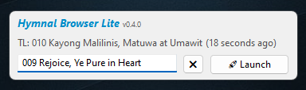
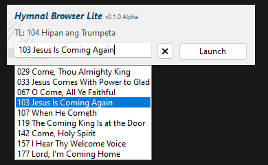

    

<h1 align="center">Hymnal Browser Lite</h1>

    A hymn browser and launcher for the Seventh-day Adventist Church &mdash; lightweight version.

## What is Hymnal Browser?

Hymnal Browser makes it easier for users to present a hymn by just typing its number or searching a keyword.

## Features

- Browse 474 hymns from the SDA Philippine Hymnal
- Portable and lightweight, no installation required
- Supports both English and Tagalog hymns

## Usage

1. Open **Hymnal Browser Lite**
2. Type the number or the title of the hymn
3. Click <Kbd>Launch</Kbd> or press <Kbd>Enter</Kbd> to launch the presentation.

## [Download Hymnal Browser Lite](https://knv.li/hbl-latest)

## Screenshots

## Support

- [Website](https://msdacsystems.com)
- [Email](mailto:msdac@msdacsystems.com?subject=Hymnal%20Browser%20Lite%20Support)
- [Changelog](CHANGELOG.md)
- [Documentation](DOCUMENTATION.md)

Hymnal Browser Lite © 2022-2025 MSDAC Systems
