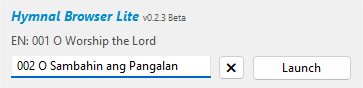

    
    <h1 align="center">Hymnal Browser Lite</h1>
    
A hymn browser and launcher for Seventh-day Adventist Church, lightweight version.

     
    <h2 align="center">What is Hymnal Browser?</h2>
    
Hymnal Browser makes it easier for users to present a hymn by just typing its number or searching a keyword.

    

## Features
- Browse through 474 Hymns based on SDA Philippine Hymnal
- Fast and responsive search
- Statistics for hymns

## Usage
1. Open Hymnal Browser Lite
2. Type the number or the title of the hymn
3. Click <Kbd>Launch</Kbd> or press <Kbd>Enter</Kbd> to launch the presentation.

Suggestion box will appear when you type in the search bar. This helps to find what hymn matches the keyword.

<a class=download href='https://sourceforge.net/projects/hymnalbrowser-lite/files/latest/download'>Download  from SourceForge</a>

## Screenshots
</img>

## Support
- [Email](mailto:msdacsystems@gmail.com)
- [Changelog](CHANGELOG.md)
- [Documentation](DOCUMENTATION.md)

Hymnal Browser Lite © 2022 MSDAC Systems