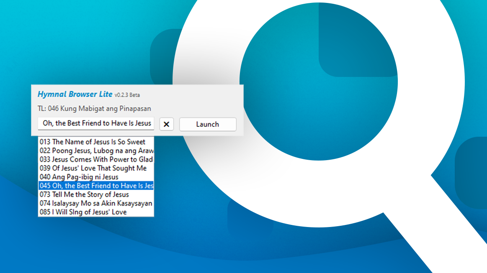

    
    <h1 align="center">Hymnal Browser Lite</h1>
    
A hymn browser and launcher for Seventh-day Adventist Church, lightweight version.

     

## What is Hymnal Browser?
Hymnal Browser makes it easier for users to present a hymn by just typing its number or searching a keyword.

## Features
- Browse through 474 Hymns based on SDA Philippine Hymnal
- Fast and responsive search
- Statistics for hymns

## Usage
1. Open **Hymnal Browser Lite**
2. Type the number or the title of the hymn
3. Click <Kbd>Launch</Kbd> or press <Kbd>Enter</Kbd> to launch the presentation.

## [Download Hymnal Browser Lite](https://sourceforge.net/projects/hymnalbrowser-lite/files/latest/download)

## Screenshots

## Support
- [Email](mailto:msdacsystems@gmail.com)
- [Changelog](CHANGELOG.md)
- [Documentation](DOCUMENTATION.md)

Hymnal Browser Lite © 2022 MSDAC Systems